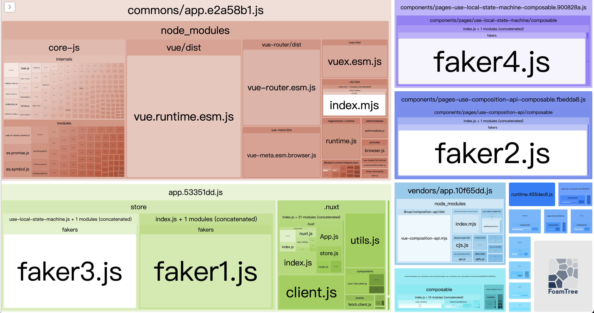

# nuxt-local-state-machine-demo

## Build Setup

```bash
# install dependencies
$ yarn install

# serve with hot reload at localhost:3000
$ yarn dev

# generate webpack analyze
$ yarn analyze
```

## Special Directories


### `composable`
```
composable -> 💡 共用 composition api
├── index.js
├── scope
│   ├── useProvider -> 💡 類似 react.createContext
│   │   └── index.js
│   ├── useScope -> 💡 類似 react.useContext
│   │   └── index.js
│   └── utils
│       └── index.js
├── useReducer -> 💡 類似 react.useReducer
│   └── index.js
└── useStateMachine -> 💡 state machine 和 vue/nuxt 街口
    └── index.js
```
### `helpers`
```
helpers
└── stateMachine -> 💡 stateMachine
    ├── core
    │   ├── createActions
    │   │   └── index.js
    │   ├── createGetters
    │   │   └── index.js
    │   ├── createMutations
    │   │   └── index.js
    │   └── createStateMachine
    │       └── index.js
    └── utils
        └── index.js
```

## `component` & `composition-api` demo
若 component 要使用 `composition-api`，在 component folder 下會有一個 `composable` folder 來放所有的 `composition-api` 
統一從 `composable/index.js` 當 entry point

> `composable` folder 底下可以有多個 composition-api，在從`composable/index.js` 引入給 component 使用


```
components/pages/use-composition-api
├── composable
│   └── index.js -> 💡 執行 init function
├── index.vue
└── page-name
    ├── composable
    │   └── index.js -> 💡 執行 init function
    └── index.vue
```
## webpack analyze
